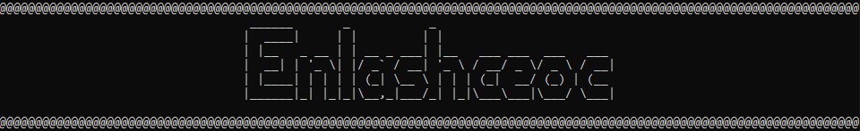

##### No one asked...
#### No one waited...
### AND HERE IT IS !!!

---
### What is Enlashcheok?
Enlashceoc is a game, a 2D maze 
with a simple goal — get player pawn to maze exit.

---
### Why Enlashcheok?
Initally created as "test grounds" to learn/research C#, 
project turned out to be full-size 2D game with procedural 
level generation and home-grown text graphics engine (kind of).  
Personally, I had a lot of fun exploring, building and testing this project. 
I even discovered *random image creation algorithm* (by accident)
during main stage of project "LevelGenerator" - [link](https://github.com/HardcoreMagazine/RandomImageGenerator).  
Overall, this might not be the best realization of maze game project, 
but I'm satisfied with the results and most likely discontinue the development.

---
### Licence
+ [MIT License](LICENSE.txt)

---
### Download & compatibility
+ [.NET 6 dependant version](https://github.com/HardcoreMagazine/Enlashceoc/releases/download/v1.0/Enlashceoc_game.zip) 
[tested on Windows 10 x64, may not work on other systems/architectures]
+ [.NET 6 independant version](https://github.com/HardcoreMagazine/Enlashceoc/releases/download/v.1.0-portable/Enlashceoc.zip) [built for Windows x64 systems only]

---
### List of known issues (wont be fixed)
+ After level re-generation player decides to exit game, 
timer shows 0 ms passed, even if many more has passed
+ From time to time game creates unbeatable mazes (dead end on player start and/or maze exit) - 
**workaround** by level re-generation (game restart)
+ GUI display incorrectly (screen is not fully filled) when debugging/running in IDE (Visual Studio for example)

---
### How to play
You control player pawn '@'. In order to win a game you must move
pawn to a maze exit 'E' using controls and interact with it.  
Game controls will be shown to player every time new game started (that excludes restarts),
but just in case:
+ RESTART GAME - R
+ INTERACT - Spacebar
+ EXIT GAME - Esc
+ MOVEMENT - Arrow keys  

### Have fun!